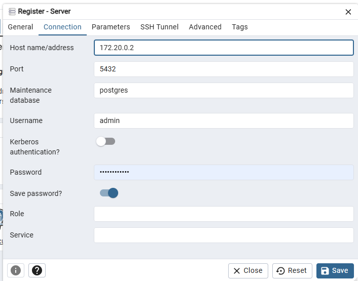

# Rodar aplicação

Para iniciar os serviços use:

```
docker compose up
```


> Caso precise apagar todos dados use:
```
docker compose down -v
```

## pgadmin

Para acessar o sistema:

**Usuario**

`admin@gmail.com`

**Password**

`Senh4Turm4#1`


Para se conectar o servidor use essas informações:



**Hostname\address**

você vai pegar no inspect do postgres no docker buscando o campo "IPAddress":
```
docker inspect my-postgre
```

**Username**

`admin`

**Password**

`Senh4Turm4#1`

## Keycloack

Acesso para o Keycloack

**Username**

`admin`

**Password**

`Senh4Turm4#1`